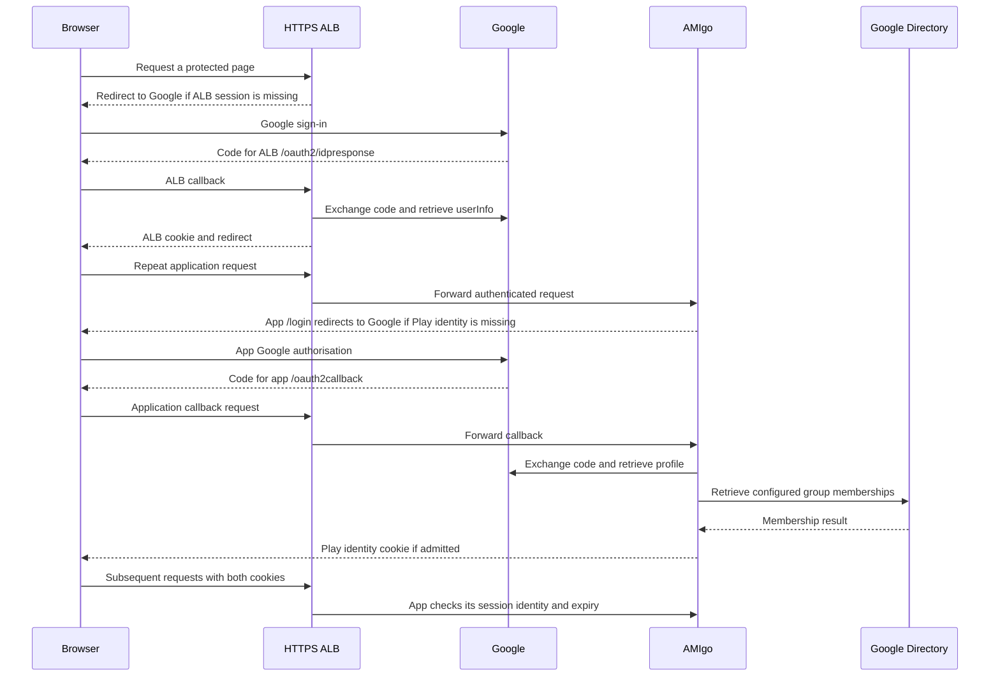
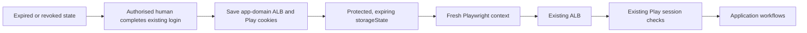
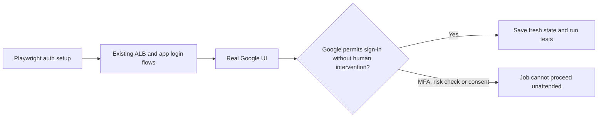
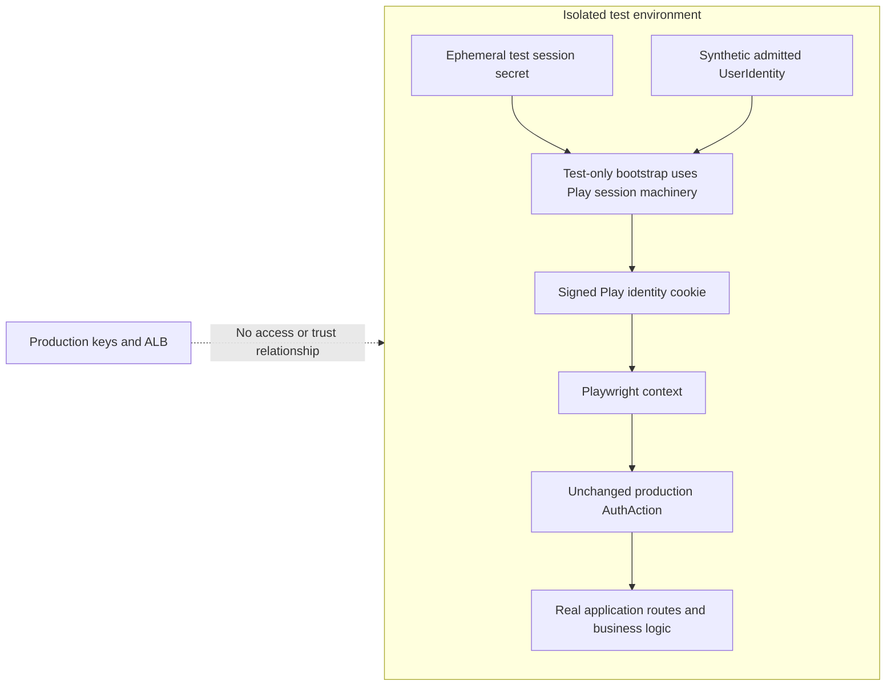
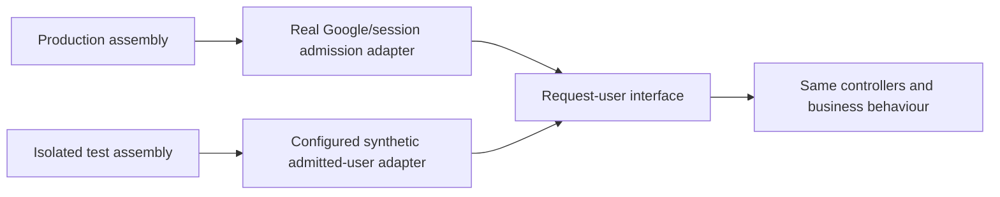
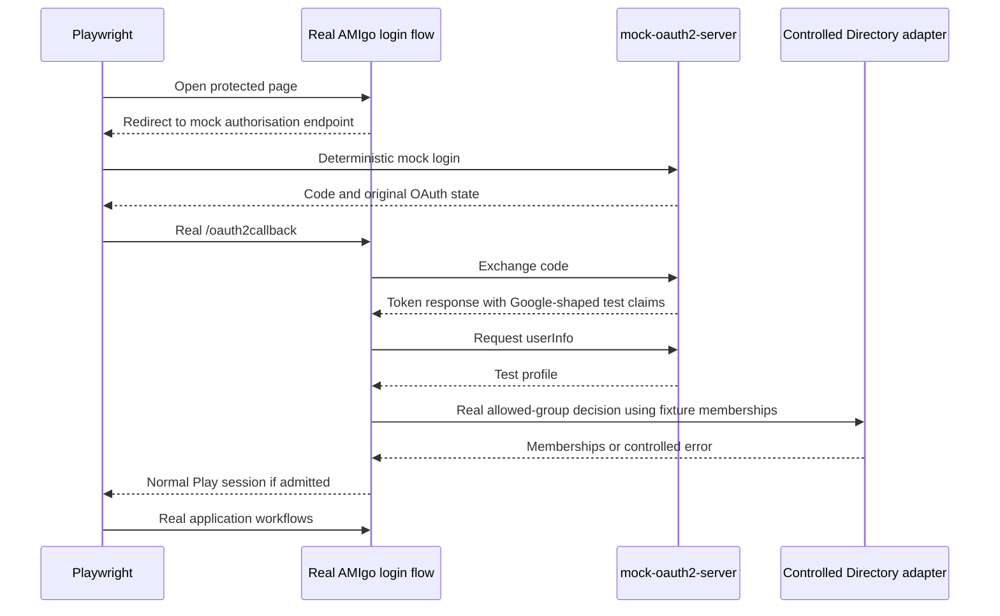
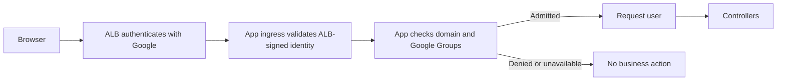
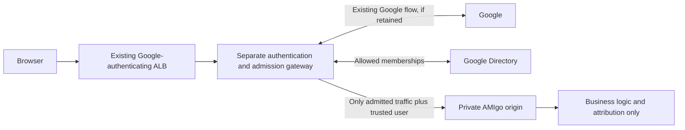
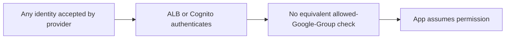

# Authentication, authorisation and end-to-end testing

AMIgo needs a reliable Playwright suite without weakening its existing access
policy or requiring routine CI jobs to refresh a human Google login. We propose
separating that testing requirement from a production authentication migration:
evaluate a controlled OAuth/OIDC server for local application E2E, retain the
current production controls initially, and consider external admission as an
independent architectural decision. This ADR is a proposal, not approval to
deploy a gateway, Cognito or an authentication bypass.

## Context and scope

The primary target is **local/ephemeral CI application E2E, plus deployed smoke
checks**. Routine CI must run without manual Google login or session refresh.
The preference is to keep authentication and authorisation outside the app, but
the required outcome is automated confidence with at least the current level
of production security.

This assessment uses repository baseline `c0844e4` and the pinned
`play-googleauth` 42.0.0 implementation. The current checkout has the original
Google login in Play and direct Google OIDC at the ALB. Previously discussed
gateway designs are alternatives, not the baseline. Live AWS configuration,
Google Workspace policies and actual token lifetimes have not been inspected.

**Terms used here**

| Term | Meaning |
| --- | --- |
| Authentication | Establishing who the user is. |
| Authorisation / admission | Deciding whether that user may enter AMIgo: the permitted domain and at least one allowed Google Group. |
| Request user | The already-admitted subject, email and name used for attribution. It need not expose tokens, groups or provider details to business code. |
| Application E2E | Browser interactions through real application routes, templates, business logic and controlled persistence. External identity or cloud systems may be explicitly substituted. |
| Deployed auth E2E | The actual deployed ALB, real Google/federation configuration, admission and app working together. A local mock does not prove this. |
| Role | In AMIgo, an Ansible provisioning role. This ADR does not introduce access-control roles or multiple user permission tiers. |

Having one access level makes admission binary. It does **not** mean every
authenticated Google or Cognito user should be admitted.

## Current authentication and authorisation

There are two independent login/session layers:

1. The public HTTPS ALB authenticates against Google before forwarding.
   It requests `openid`, supplies the `hd=guardian.co.uk` login hint and uses
   the default ALB session settings. No Cognito pool exists in this code.
2. Play's `AuthAction` redirects a missing/expired application identity to
   `/login`. The app completes another Google code flow at `/oauth2callback`,
   checks the configured email domain and retrieves the user's Google Groups.
   Membership in **any one** allowed group permits login. [R1], [R2], [R3], [R4]

The app stores a JSON identity in its signed Play session. Subsequent
`AuthAction` requests read that identity and enforce its `exp`. Group membership
is checked during the application login callback, not on every request.
`maxAuthAge = 90 days` is not a 90-day application-session lifetime. [R1], [R4]



These redirects need not cause two password prompts: Google's existing SSO
session may satisfy a flow. That does not make the ALB and Play sessions the
same session.

Other relevant controls:

- The app requires `guardian.co.uk` as the email domain. The ALB's `hd` request
  parameter is a login hint, not the Google Group policy.
- CSRF, security headers, CSP and rotating Play secrets remain relevant
  regardless of where login lives.
- Business actions record `createdBy`, `modifiedBy` or `startedBy`.
- `/healthcheck` is anonymous inside Play; the public ALB listener still
  authenticates requests to that path. ALB target probes reach it directly.
- The ALB is internet-facing; instances receive application traffic through
  ALB security groups. Do not interpret the old application comment as proof
  that the public hostname is VPN-only. [R2], [R3], [R7]

## What "same level of security" requires

An option is acceptable only if it preserves the following outcomes, not merely
the appearance of a login screen.

| Invariant | Required evidence |
| --- | --- |
| Authentic identity | Identity comes from the approved provider or a demonstrably trusted ingress, not a caller-chosen header or native account with a Guardian-looking email. |
| Equivalent admission | Preserve the domain and any-one-allowed-group policy, including the intended membership semantics. Cognito provider groups are not Google Groups. |
| No bypass | The app cannot be reached publicly around an external gate; test endpoints, keys and fake IdPs cannot grant production access. |
| Fail closed | An unavailable required identity/group check cannot become permission to proceed. |
| Comparable expiry/revocation | Removing the Play identity must not silently extend access to the ALB's seven-day default. Establish current effective expiry, group-removal and Google-account suspension behaviour before replacing it. |
| Trusted attribution | The app receives the correct user for audit fields, even if it makes no permission decision. |
| Request integrity | Retain CSRF, appropriate cookies/TLS, OAuth state checks and secure handling of session material. |
| Operational ownership | Keys, secrets, cached decisions, outage behaviour and rollback have an owner and negative tests. |

The existing code restricts email domain; a verified Google `hd` claim is a
different assertion about Workspace membership. Confirm any deliberate
strengthening or change rather than silently replacing one rule with the
other. Similarly, changing Directory APIs can change direct/nested membership
semantics. [G1], [G2]

## Options at a glance

Scores are **relative effort, not time estimates**. They concern authentication
and test enablement, excluding the shared work to isolate data and external
baking dependencies. Scores are ordinal, not additive.

| Score | Meaning |
| --- | --- |
| 1 | Configuration/setup with little application change |
| 2 | Focused test harness or fixture work |
| 3 | Protocol integration or a modest application seam |
| 4 | Cross-application/infrastructure migration |
| 5 | Multiple deployable/stateful pieces and substantial security/operational acceptance |

Upkeep uses the same 1-5 scale, from low routine maintenance to high operational
burden. These are engineering judgements based on the changes described below.

| Option | Initial effort | Upkeep | Unattended local CI | What remains in app | Assessment |
| --- | ---: | ---: | --- | --- | --- |
| A. Real login once, reuse storage state | 1 | 3 | Only until state needs renewal | Existing auth | Useful manually; fails the routine-CI requirement |
| B. Automate real Google login | 3 | 5 | Conditional and brittle | Existing auth | Not the default CI strategy |
| C. Test-only Play-session bootstrap | 2 | 1 | Yes | Existing production auth | Smallest reliable business-E2E enabler |
| D. Test-only admitted-user adapter | 3 | 2 | Yes | Real auth behind a replaceable seam | Explicit seam, but auth flow is skipped |
| E. Mock OAuth/OIDC and Directory | 3 | 2 | Yes | Existing production auth flow | Recommended first experiment; includes mock-oauth2-server |
| F. ALB login, app admission | 4 | 3 | Needs a test identity strategy too | Verification/group admission | Partial architectural simplification |
| G. External admission gateway | 5 | 4 | Yes, with local/test user context | Trusted-user adapter only | Strong externalisation option; not needed merely to unlock E2E |
| H. ALB + Cognito + upstream admission | 5 | 4 | Needs a separate local/test strategy | Trusted-user delivery only in a strict external design | Feasible conditionally; Cognito alone is insufficient |
| I. ALB/Cognito with no equivalent group gate | 3 | 2 | Does not itself solve CI login | Little auth | Rejected: changes who is allowed in |

## A. Leave production unchanged and reuse a real browser session

**Flow**



Use a genuine login on the target origin, wait for both authentication flows to
finish, then save browser state. Playwright setup/fixtures load that state into
fresh contexts. The repository already supports `PLAYWRIGHT_STORAGE_STATE`.
Locally only the app session is relevant; against CODE both ALB and Play state
are required. Cookies from localhost are not credentials for CODE. [P1], [R8]

**Changes:** no production auth changes. Add capture/validation instructions,
secure state storage, expiry detection and possibly per-worker setup files.
Minimise captured state to the required application cookies rather than
retaining unrelated Google-account cookies.

**Security and coverage:** normal login controls are preserved, but a state file
is a credential capable of impersonating its user. Do not commit it, expose it
to untrusted PRs or upload it in traces/artifacts. Use an approved test account,
not a developer's production session. Playwright isolates contexts; it does
not refresh expired credentials or isolate server-side data. [P1]

The tests exercise the application as a genuinely signed-in user, but normally
skip the login flow itself. Once either session is invalid, they need a working
renewal process. An existing Google session might help, but guaranteed
unattended renewal indefinitely is not established.

**Effort: 1/5; upkeep: 3/5.** Appropriate for manual exploration or controlled
deployed acceptance. Not sufficient for the stated routine-CI requirement.

## B. Leave production unchanged and automate the real Google UI

**Flow**



A setup project navigates through the actual sign-in flow using a dedicated,
approved account, then reuses the resulting state. Application code can stay
unchanged, and a successful run can cover deployed login as well as application
behaviour.

**Changes:** account provisioning, credential handling, Google-UI automation,
setup dependencies, session-expiry handling and operational recovery. Google
is not a username/password login endpoint owned by AMIgo.

**Security and coverage:** retain Workspace MFA and risk controls. Disabling
MFA, storing a human's production credentials, or treating an automated
password/TOTP arrangement as automatically equivalent would not meet this ADR.
Any approved automation account and second-factor arrangement needs its own
security decision.

Google challenges, consent screens, account locks, browser/UI changes and
external outages make this brittle. This is an engineering risk assessment,
not a claim that all Playwright use is formally prohibited by Google.
Playwright itself recommends controlling third-party dependencies in routine
tests. [P2]

**Effort: 3/5; upkeep: 5/5.** Potentially useful for a small, explicitly owned
real-login canary. Not recommended for every functional test or as a guaranteed
headless CI bootstrap.

## C. Keep auth unchanged and issue a session only inside the test environment

**Flow**



The pinned library stores `UserIdentity` JSON under the Play-session key
`identity`; subsequent requests check the session and identity expiry rather
than calling Google again. A test-only launcher/bootstrap can use Play's actual
session machinery and the library's identity type to create this state with
an ephemeral **test** secret. Playwright then runs the real application behind
that session. Do not hand-roll Play's signing format. [R4], [PL1]

**Changes:** test-only session setup, controlled test configuration/secret
provider, and Playwright setup fixtures. Production authentication behaviour
need not change. A full isolated app launcher may still require construction
seams for AWS/data configuration; "unchanged auth" does not mean no test harness.

Prefer an in-process/test-classpath bootstrap or a private test-only HTTP
fixture that returns the normal Set-Cookie response. It must not be a deployed
`/test-login` route protected only by an environment flag.

**Security and coverage:** never give CI production Play signing secrets, mint
CODE/PROD user cookies, or turn off signature/expiry/CSRF checks. Prove the test
bootstrap is absent from deployed artifacts and its secret is not trusted
outside the test environment.

This exercises production session consumption, attribution and application
workflows. It **does not** test Google authentication, the OAuth callback or
the group decision that would normally precede that session. Test those
separately. It also cannot get through the deployed ALB: issuing a Play cookie
does not issue an ALB cookie.

**Effort: 2/5; upkeep: 1/5.** The smallest reliable option when the immediate
goal is business-workflow coverage and production auth should remain untouched.

## D. Keep real auth, but inject an admitted-user adapter in test builds

**Flow**



Introduce a narrow interface where controllers receive a request user. The
production adapter preserves existing authentication/admission. Test assembly
supplies a fixed or scenario-specific user without login.

**Changes:** refactor the current concrete `AuthAction` dependency into an
appropriate request-user seam; change assembly and test fixtures, while keeping
production policy intact. Keep fake implementations in test/development-only
assembly, not branches sprinkled through controllers.

**Security and coverage:** production must fail closed if its real adapter
cannot initialise. No `X-Test-User` accepted from the public network, no
automatic fallback, and no broad `auth.disabled` flag usable in deployment.
Verify factory selection and artifact/configuration isolation.

This is easier to understand than manufacturing framework cookies when many
tests need different users, and improves locality of auth knowledge. It skips
the real authentication/session path, so it needs dedicated adapter/auth tests.
It does not satisfy the ideal of all production auth being outside the process.

**Effort: 3/5; upkeep: 2/5.** A maintainable alternative to C if a request-user
seam is independently desirable.

## E. Mock OAuth/OIDC with navikt/mock-oauth2-server, plus a Directory fixture

This option keeps the app's real login/callback/session/group-policy flow while
replacing external identity systems in isolated tests.

**Flow**



`navikt/mock-oauth2-server` supports authorisation-code flow, discovery, signed
JWTs, JWKS, userInfo, scripted claims and interactive/non-interactive test login.
It can run as a JVM test dependency or a standalone container. Release 6.0.2
was the stable release examined; pin a reviewed version/image rather than
`latest`. Prefer a standalone process/container when that avoids adding Kotlin,
HTTP or JSON dependency conflicts to the Play runtime. [M1], [M2], [M3]

**It is not a drop-in configuration change for this app.** In
`play-googleauth` 42.0.0:

- Google's discovery URL is hard-coded, and its discovery result is cached
  globally.
- The token model expects Google-shaped fields, including `azp`, `at_hash`,
  Boolean `email_verified`, numeric times and a compatible scalar `aud`.
- The profile model requires `name`, `given_name` and `family_name`.
- Google Groups come from the separate Directory API, not OIDC claims.
  [R5], [R6]

**Changes inside the app/test harness:** provide a narrow test-only discovery
or WS-client adapter so the login library discovers the mock endpoints, and
inject a controlled Directory lookup. Keep the real production domain/group
decision and OAuth state/session code. Prefer an upstream-supported
configurable discovery seam or test-assembly decoration over mutating the
library's global discovery cache between concurrent tests.

**Changes outside the app:** launch and stop the mock with the test environment;
configure fixtures for both token and userInfo responses; use a hostname
reachable from browser and backend. Container-only DNS names in redirect/issuer
URLs are not necessarily reachable by the host browser. Give parallel workers
deterministic subjects/claims instead of racing over a global callback queue.

The mock's userInfo endpoint returns verified access-token claims, so configure
the required profile fields there as well as in the ID token. Validate actual
wire shapes; do not assume generic OIDC defaults match the pinned Google
parser. The mock does not provide Google Directory or an AWS ALB session.
`page.route()` alone also cannot intercept the backend's Google calls.
  [M1], [M2], [R5], [R6]

**Security and coverage:** trust the mock only in isolated test assembly, use
test credentials/secrets, and leave production's Google endpoint/trust
unchanged. Keep state, expiry, domain, group and CSRF checks enabled. JWKS
availability in the mock does not add signature validation to a client that
does not use that JWKS; test the checks actually implemented by the client,
not assumed protocol features.

This covers substantially more of AMIgo's login integration than C/D and still
runs without a human. Test successful login, wrong domain, no permitted group,
Directory failure, invalid state, malformed claims and expired application
identity. It does not establish real Google UI/MFA, ALB configuration or
production federation correctness.

**Effort: 3/5; upkeep: 2/5.** Recommended first compatibility experiment for the
stated requirement. After successful mock login, reuse its freshly generated
state per worker to avoid repeating login in every business test.

## F. Use ALB authentication, but retain admission inside the app

**Flow**



Remove the inner Google OAuth flow and Play identity session. An application
ingress module verifies the ALB signature/expected signer and applies group
admission, then supplies a request user to business handlers.

**Changes inside:** replace Google login actions/configuration with a cohesive
ALB verifier/group module and request-user adapter. Preserve audit fields and
CSRF/session support needed for forms.

**Changes outside:** supply expected ALB/issuer/client settings, ensure necessary
identity scopes/claims, preserve private-origin restrictions and plan session
cutover. Tests still need a local identity adapter, signed fixtures or an
ALB-emulating test proxy.

**Security and coverage:** do not trust unsigned ALB headers or merely decode a
JWT. Verify its signature and expected ALB ARN before using claims. Removing
the Play identity-expiry check changes the effective session policy unless
explicitly compensated. Per-request group checks may improve membership
revocation but do not automatically reproduce Google account/session
reauthentication. [A1]

**Effort: 4/5; upkeep: 3/5.** Eliminates duplicate OAuth login and can keep
business controllers clean, but still has admission in the app process.
It neither fulfils strict externalisation nor independently solves unattended
Google authentication for deployed tests.

## G. Move authentication/admission into a separate gateway

**Flow**



Move the existing app login/group functionality to a separate process/service.
For the smallest behavioural change, it can preserve the inner Google flow,
session expiry and group-check timing while removing those responsibilities
from AMIgo. There are still two login/session layers, but neither is implemented
inside the business app.

A consolidation variant makes the gateway consume the ALB-signed identity and
perform group admission directly. That avoids the inner Google flow but has
the same expiry/reauthentication equivalence questions as F. These are distinct
policy choices, not an automatic consequence of extracting a module.

**Changes inside the app:** remove Google/JWT/group code and configuration;
retain only a trusted request-user interface for subject/email/name. Missing
or malformed ingress identity must fail before a business operation. Keep
CSRF, flash/session infrastructure and business safety rules.

**Changes outside:** package, deploy, supervise and monitor the gateway; migrate
its credentials/configuration; forward only to a fixed private origin; strip
spoofed principal headers; preserve bodies, streaming, redirects and cookies.
A same-instance process can own ALB target port 9000 while the app binds
loopback on another port. A separate-host gateway needs protected,
authenticated communication to the origin.

**Security and coverage:** the gateway is the security enforcement point. Its
failure cannot open direct app access. Same-host loopback explicitly trusts the
host and local processes; it is not cryptographic protection from host
compromise. IAM/file permissions and ingress provenance must be deliberate.
Test the gateway as a deep module through its interface, and exercise its
connection to the app separately.

Locally, an isolated app can use a configured admitted test user without any
Google interaction. App E2E and gateway/auth tests become separate suites.
Real deployed Google login still needs an approved bootstrap; the move itself
does not create one.

**Effort: 5/5; upkeep: 4/5.** A strong option if external ownership is a goal in
its own right. Cognito is not required just to move the existing admission
policy out of the app.

## H. Move login and binary admission upstream with ALB and Cognito

**Flow**

```mermaid
sequenceDiagram
    participant B as Browser
    participant L as ALB
    participant C as Cognito
    participant G as Google
    participant P as Upstream admission Lambda
    participant D as Google Directory
    participant I as Trusted identity ingress
    participant A as Private AMIgo
    B->>L: Request without ALB session
    L-->>B: Redirect to Cognito
    B->>C: Authorisation request
    C-->>B: Federate to Google
    B->>G: Google authentication
    G-->>B: Code for Cognito callback
    B->>C: Complete federation
    C->>P: Evaluate token issuance
    P->>D: Check authoritative allowed-group policy
    D-->>P: Membership or error
    alt Admitted
        P-->>C: Permit token issuance
        C-->>B: Code for ALB callback
        B->>L: Complete ALB authentication
        L->>C: Exchange code and retrieve userInfo
        L-->>B: ALB session cookie
        B->>L: Application request
        L->>I: Forward ALB-signed identity
        I->>A: Trusted request user; no app admission logic
    else Denied or required check unavailable
        P-->>C: Fail token issuance
        C-->>B: Authentication/admission failure
    end
```

This is more than changing `authenticateOidc` to `authenticateCognito`.
Cognito brokers Google authentication; it does not automatically know AMIgo's
Google Groups. The admission implementation must be supplied. [A1], [A2], [A8]

**Required external changes**

- Create stage-specific user pools, managed-login domains, Google federation
  settings and confidential app clients with authorisation-code grant,
  appropriate scopes and provider restrictions.
- Configure two distinct callbacks: Google returns to the Cognito-domain
  `/oauth2/idpresponse`; Cognito returns to the application-domain ALB
  `/oauth2/idpresponse`.
- Map email, verified email and profile name deliberately. Cognito userInfo
  currently returns `email_verified` as a string. ALB forwards signed userInfo
  claims, not the Cognito ID token; custom ID-token claims do not automatically
  appear in what the app receives. [A2], [A6], [A10]
- Implement authoritative domain/group admission upstream, with the required
  Directory service identity, least-privilege credentials, bounded calls and
  monitoring.
- Restrict alternative clients/providers/native login paths so they cannot
  skip the same policy. A native user with a Guardian-looking email is not
  proof of Google authentication or Workspace membership.
- Define token/refresh/session/revocation policy, state retention, cutover,
  rollback and ownership of new Cognito resources.

**Where the admission decision can run**

A pre-token-generation Lambda is a candidate because it participates in token
issuance and refresh. Denial or dependency failure must fail issuance, not
just add an `admitted=false` claim that ALB does not enforce. Cognito invokes
triggers synchronously with a five-second response limit, so Directory access
has a concrete latency/availability budget. Verify the exact events produced by
the selected federation and ALB-driven refresh flows. [A3], [A4]

First-signup-only checks cannot revoke an existing user's access. Current AWS
documentation lists pre-authentication for subsequent federated sign-ins and
also documents an inbound-federation trigger; neither should be treated as a
substitute for refresh-time policy. Do not rely on older blanket statements
about which federation triggers run. [A3], [A5]

An alternative is externally managed membership synchronisation or upstream
Workspace application restrictions. These require verified equivalent policy,
removal reconciliation, stale-data expiry and operational ownership. They are
not supplied by vanilla Cognito. Preserve current membership semantics rather
than broadening access through a different nested-group lookup.

**Required application and ingress changes**

Remove the inner Google login/group implementation and consume a normalised
request user. Enforce a private origin and reliable attribution. AWS recommends
validating ALB JWT signatures and the expected signer; simply accepting an
arbitrary `X-User` header is not an equivalent design. [A1]

A standard ingress adapter can verify identity provenance and expose the user.
If all verification implementation must also be outside the app process, use
an infrastructure-owned identity relay/proxy with a protected private user
contract. If verification remains in an application middleware library, be
honest: app-specific policy has moved out, but not every auth-related operation.
This identity-delivery choice is included in the effort score.

**Security conditions and limitations**

Groups must be reconsidered on appropriate renewals. Effective revocation
includes Directory propagation, caching and the next enforced refresh/session
event. Without refresh support an ALB session may outlive access-token expiry.
Cognito refresh is not proof that Google has reauthenticated the user or
rechecked account suspension, domain changes or Workspace policy. Prove those
behaviours are no worse than the baseline before claiming equal security.
[A1], [A3], [A4]

**Testing implications**

Local E2E can use an admitted test-user adapter or test IdP with no production
trust. Cognito still federates real deployed users to Google, so moving auth
does not itself remove the need for Google authentication in deployed browser
tests. Client credentials, `AdminInitiateAuth` or an access token are not a
documented shortcut to the ALB browser cookie. A fake IdP/native test user in a
production-trusted pool is a new authentication mechanism, not a harmless test
configuration. [A7], [G3]

**Effort: 5/5; upkeep: 4/5.** Can meet the externalisation preference with a
complete admission and identity-delivery design. Security equivalence is a
condition to demonstrate, not an automatic property of adding Cognito.

## I. Remove app admission and rely on ALB/Cognito login alone



**Effort: 3/5; upkeep: 2/5, but not eligible for adoption.** This removes code,
but changes the admitted population unless an independently verified upstream
policy supplies exactly the missing restriction.

`hd=guardian.co.uk`, a matching email suffix, a Cognito account or Cognito's
automatically created Google-provider group does not establish membership in
an allowed Google Group. If equivalent upstream admission is added, this
becomes H rather than remaining a simple ALB/Cognito-only option. [A8], [G1], [G2]

## Approaches that are not substitutes for an auth design

- Playwright API login is useful only when the application offers a suitable
  supported login API. AMIgo currently offers Google redirects/callbacks, not
  a first-party password/token-to-session endpoint. [P1]
- Google service accounts, domain-wide delegation and AWS IAM credentials
  authorise API/workload access; they are not automatically browser-user
  sessions. Cognito client credentials return an M2M token, not an ALB cookie.
  [G3], [A7]
- Browser request interception cannot by itself replace server-side token or
  Directory calls. Replacing app API responses/HTML also stops those tests
  being full application E2E.
- Do not create a public no-auth listener, accept forged identity headers,
  disable CSRF/MFA, or give CI production session-signing keys just to pass
  a test.

## Proposed decision

**First, validate E with a small compatibility experiment against the current
Google client, without changing production access policy.** Use
`mock-oauth2-server` and a separate Directory fixture to authenticate the test
browser through AMIgo's real callback. Reuse the resulting test state per
worker for the wider functional suite.

The experiment must demonstrate discovery redirection, compatible token and
userInfo shapes, successful session creation, wrong-domain/group rejection,
Directory failure, invalid state and expired identity. It must prove test
trust cannot be selected in deployed assembly. This is not a request to
implement that experiment as part of writing this ADR.

If the compatibility work is disproportionate to the immediate test goal,
choose C for business E2E and keep focused login/admission integration tests.
Do not implement two independent authentication bootstrappers by default.

Do not migrate to Cognito solely to make Playwright run. Consider G or H in a
separate approved implementation decision if external ownership justifies
their operational cost. G can externalise current policy without Cognito; H
adds a managed identity broker but still requires policy and identity-delivery
work. Both still need a deliberate CI identity strategy.

No externalisation option is accepted here until expiry/revocation, permitted
identities, origin protection and failure behaviour satisfy the security
invariants.

## What the deployed smoke checks will and will not prove

The selected requirement permits unattended local E2E plus deployed smoke, not
necessarily a fresh, authenticated Google login on every deployment.

| Check | Routine automation without Google login | What it proves |
| --- | --- | --- |
| Public HTTPS/TLS and expected auth redirect | Yes | Public ingress is available and starts the intended auth flow |
| Target readiness/build version through approved private operational access | Yes, with IAM/network access | The deployed app is running; this is not an authenticated public-browser test |
| Local full application workflows with controlled test identity/IdP | Yes | Application behaviour under defined fixtures |
| Local auth protocol and negative admission tests | Yes | Our integration and policy handling, not Google's live service |
| Real CODE login, group restriction and renewal/revocation | Requires an approved real authentication arrangement | The deployed identity configuration actually works |

Use existing operational access for private health checks; do not open a public
origin bypass for testing. Keep a controlled real CODE acceptance procedure
for auth-related releases. A manually renewed storage-state canary is an
optional operational choice, not a dependency of routine CI.

If fully unattended **authenticated public CODE smoke** later becomes mandatory,
record a separate approved workload/test-user authentication and renewal
mechanism. None of these options makes that requirement disappear.

## Common implementation and test requirements

- Run real application pages/routes/business logic and controlled persistence.
  Stub only explicitly external systems; do not substitute success-shaped
  application responses and call the result end-to-end.
- Establish an isolated application startup/data harness. Today AppLoader and
  AppComponents load AWS configuration, initialise data and start scheduled
  work. Auth changes alone do not isolate DynamoDB, S3, Prism, Packer or
  housekeeping.
- Use unique worker-owned recipe/base-image IDs and controlled cleanup.
  Different login accounts do not isolate AMIgo's global data. Coordinate or
  disable destructive background work in the test environment.
- Keep secrets, storage state and sensitive traces out of source control and
  untrusted CI artifacts. The current `trace: 'on'` warrants deliberate handling
  if tests ever use real accounts.
- Keep test-only issuers, keys, bootstrap routes and users outside deployed
  trust. Assert this in packaging/configuration tests.
- Continue testing expiry, malformed state, denied domain/group, dependency
  failure, attribution and CSRF separately from happy-path workflows.
- Place test plans under `specs/`. An ADR records the architectural trade-off;
  it is not a replacement for an executable test plan.

## Decision gates for an external-auth migration

Before accepting F, G's consolidation variant or H, resolve and verify:

1. The current effective identity lifetime and account/group-removal behaviour,
   including Workspace MFA/session policy.
2. Exact domain and direct/nested group-membership semantics.
3. The authoritative Directory identity, privileges, quotas, cache and fail-closed
   behaviour.
4. Cognito trigger/event/feature-tier support for initial federation, subsequent
   sign-in and the exact refresh path used by ALB.
5. Attribute provenance and mapping, including verified-email representation
   and what ALB actually forwards.
6. Private-origin enforcement, identity-delivery trust and process/service
   ownership.
7. Behaviour during cutover, rollback and auth-service outages without
   overlapping accidental trust or an unauthenticated fallback.

The previously discussed architecture is not presumed accepted merely because
it appears among the options. The initial decision sought is whether to use a
controlled auth test dependency while keeping production policy unchanged.

## Sources

- Repository baseline: [login][R1], [application wiring][R2], [ALB][R3],
  [healthcheck][R7] and [Playwright configuration][R8].
- Pinned Google client: [actions/session handling][R4], [OAuth implementation][R5]
  and [claim models][R6].
- Test guidance: [Playwright authentication][P1], [Playwright best practices][P2]
  and [Play sessions][PL1].
- Mock provider: [versioned README][M1], [userInfo implementation][M2]
  and [6.0.2 release][M3].
- AWS: [ALB authentication][A1], [Google federation][A2], [trigger lifecycle][A3],
  [pre-token generation][A4], [inbound federation][A5], [userInfo][A6],
  [token grants][A7], [Cognito groups][A8] and [attribute mapping][A10].
- Google: [identity claims][G1], [Directory membership][G2]
  and [service-account authorisation][G3].

[R1]: https://github.com/guardian/amigo/blob/c0844e4/app/controllers/Login.scala
[R2]: https://github.com/guardian/amigo/blob/c0844e4/app/components/AppComponents.scala
[R3]: https://github.com/guardian/amigo/blob/c0844e4/cdk/lib/amigo.ts
[R4]: https://github.com/guardian/play-googleauth/blob/v42.0.0/play-v30/src/main/scala/com/gu/googleauth/actions.scala
[R5]: https://github.com/guardian/play-googleauth/blob/v42.0.0/play-v30/src/main/scala/com/gu/googleauth/auth.scala
[R6]: https://github.com/guardian/play-googleauth/blob/v42.0.0/play-v30/src/main/scala/com/gu/googleauth/model.scala
[R7]: https://github.com/guardian/amigo/blob/c0844e4/app/controllers/RootController.scala
[R8]: https://github.com/guardian/amigo/blob/c0844e4/playwright.config.ts
[P1]: https://playwright.dev/docs/auth
[P2]: https://playwright.dev/docs/best-practices
[PL1]: https://www.playframework.com/documentation/3.0.x/ScalaSessionFlash
[M1]: https://github.com/navikt/mock-oauth2-server/blob/6.0.2/README.md
[M2]: https://github.com/navikt/mock-oauth2-server/blob/6.0.2/src/main/kotlin/no/nav/security/mock/oauth2/userinfo/UserInfo.kt
[M3]: https://github.com/navikt/mock-oauth2-server/releases/tag/6.0.2
[A1]: https://docs.aws.amazon.com/elasticloadbalancing/latest/application/listener-authenticate-users.html
[A2]: https://docs.aws.amazon.com/cognito/latest/developerguide/cognito-user-pools-social-idp.html
[A3]: https://docs.aws.amazon.com/cognito/latest/developerguide/cognito-user-pools-working-with-lambda-triggers.html
[A4]: https://docs.aws.amazon.com/cognito/latest/developerguide/user-pool-lambda-pre-token-generation.html
[A5]: https://docs.aws.amazon.com/cognito/latest/developerguide/user-pool-lambda-inbound-federation.html
[A6]: https://docs.aws.amazon.com/cognito/latest/developerguide/userinfo-endpoint.html
[A7]: https://docs.aws.amazon.com/cognito/latest/developerguide/token-endpoint.html
[A8]: https://docs.aws.amazon.com/cognito/latest/developerguide/cognito-user-pools-user-groups.html
[A10]: https://docs.aws.amazon.com/cognito/latest/developerguide/cognito-user-pools-specifying-attribute-mapping.html
[G1]: https://developers.google.com/identity/openid-connect/openid-connect#an-id-tokens-payload
[G2]: https://developers.google.com/workspace/admin/directory/reference/rest/v1/members/hasMember
[G3]: https://developers.google.com/identity/protocols/oauth2/service-account
